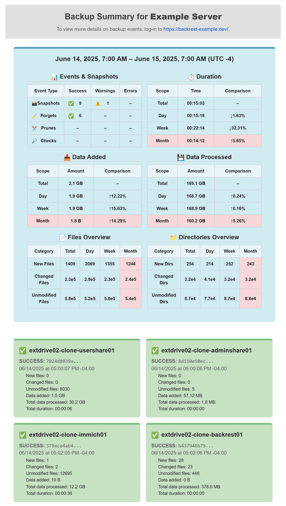
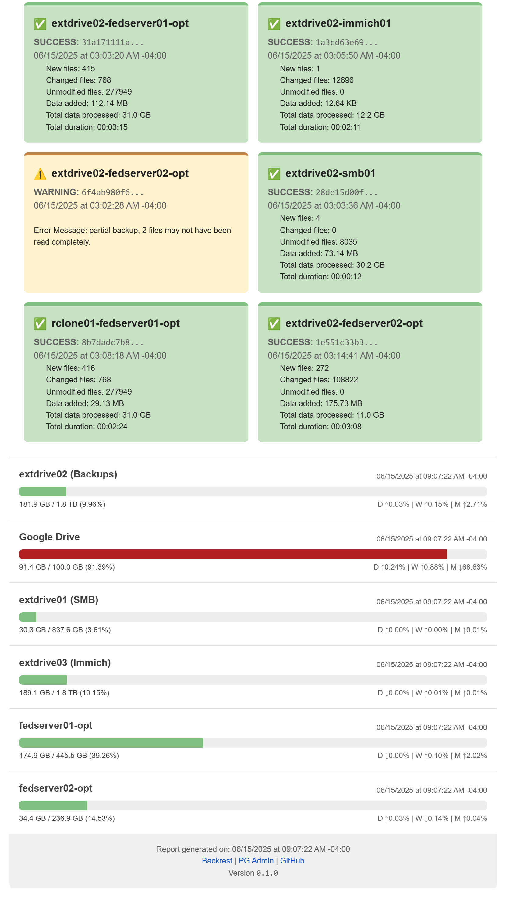
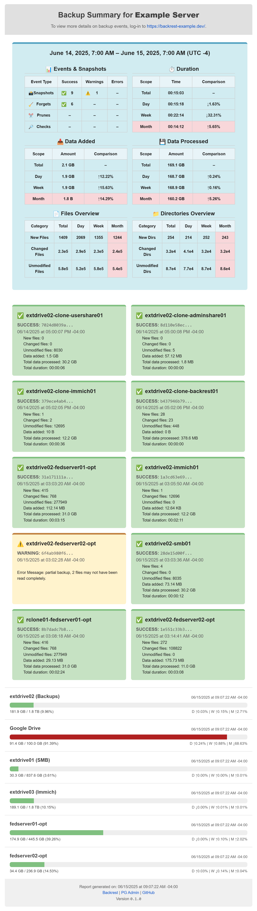

# Backrest Summary Reporter

A companion service for Backrest Restic that tracks snapshot activity and storage usage. It aggregates backup metadata into a database and sends scheduled email reports summarizing snapshot events and storage statistics.

<p align="center">
    
    
</p>

## Features

- Receive snapshot events from Backrest via webhooks and store their summary data
- Monitor and track connected storage devices
- Compare data and statistics against the previous day, week, and month to analyze trends over time
- Generate and send formatted email reports, highlighting snapshots and storages over a specified date range

## Backrest and Backrest Reporter Events

Below are the main events that regularly occur during this process.

### Backup Initiated by Backrest

When Backrest starts a snapshot, it calls the [`/add-event` endpoint](#add-snapshot-event). All the available data provided during the Backrest hook is sent and stored in the API.


### Automatic Storage Statistics

The storage stats update at `0 0 * * *` (nightly at 00:00 UTC). All provided storage paths are checked and saved for their current used/free/total disk space via the [`/update-storage-statistics` endpoint](#update-storage-statistics).

The storages that are checked are defined in the `.env`'s `STORAGE_PATH_N`. See [Setting up Storage Mounts](#setting-up-storage-mounts) for more information.


### Email Reports

Email reports occur based on the `EMAIL_FREQUENCY` defined in the `.env` and use the [`/generate-and-send-email-report` endpoint](#generate-and-send-email-report). They use the provided SMTP settings and current db to send a formatted report for all the restic events captured in the last `STATS_INTERVAL`. `STATS_INTERVAL` is defined in the `.env` and defaults to `24`, which translates to data received in the past 24 hours.

Storage statistics are also refreshed before querying the statistics for the latest, previous day, previous week, and previous month endpoint.

Email reports can also be manually called via the [`/generate-and-send-email-report` endpoint](#generate-and-send-email-report).


## Main Setup

This companion is meant to run via docker and alongside a Backrest setup. Additional configuration is covered under [Backrest Webhooks](#backrest-webhooks), [Setting up SMTP Settings](#setting-up-smtp-settings), [Setting up Storage Mounts](#setting-up-storage-mounts), and [Healthchecks](#healthchecks).

### Pre-requisites
- [Docker](https://docs.docker.com/engine/install/)
- [Backrest](https://github.com/garethgeorge/backrest)
- FUSE (optional - for remote mounts)

### Docker Compose

The [docker-compose.yaml](docker-compose.yaml) at the root of this project provides a standard setup that utilizes the main API (`backrest-reporter`) and its database (`backrest-reporter-db`).

To run this:
1. Create a new directory (or use the same as your Backrest folder).
2. Copy the [.env.example](.env.example) into a new `.env` file.
3. Modify the settings as needed (see [Environment Variables](#environment-variables)). At a minimum, configure the **Required** fields, which include database, email, and API key settings. Email settings are described [here](#setting-up-smtp-settings).
4. Run the containers.
  ```bash
  docker compose up -d --build
  ```

You can test out the configuration by sending a test email via [the `/send-test-email` endpoint](#send-test-email) to ensure it works smoothly.

At this point, you can [test additional endpoints](#endpoints) and setting up the webhooks in the Backrest settings.

### Environment Variables

| Variable                   | Description                                                                                                | Required / Default                                  |
| -------------------------- | ---------------------------------------------------------------------------------------------------------- | --------------------------------------------------- |
| **DB\_USERNAME**           | Username used to connect to the PostgreSQL database                                                        | Required                                            |
| **DB\_PASSWORD**           | Password for the PostgreSQL user                                                                           | Required                                            |
| **AUTH\_KEY**              | Secret key used to authenticate requests to internal endpoints                                             | Required                                            |
| **SMTP\_HOST**             | SMTP server hostname (e.g. `smtp.gmail.com`)                                                               | Required                                            |
| **SMTP\_PORT**             | SMTP port (commonly `587` for TLS or `465` for SSL)                                                        | Required                                            |
| **SMTP\_USERNAME**         | SMTP username (usually your email address)                                                                 | Required                                            |
| **SMTP\_PASSWORD**         | SMTP password or app-specific password (never use your main email password)                                | Required                                            |
| **EMAIL\_FROM**            | Email address and display name emails will be sent from (e.g. `Your App Name <you@example.com>`)           | Required                                            |
| **EMAIL\_TO**              | Comma-separated list of recipient email addresses                                                          | Required                                            |
| **SEND\_STARTUP\_EMAIL**   | Flag for sending email when system is first online. Set to `TRUE` or `1` to enable.                        | Optional • Default: None (`False`)                                           |
| **EMAIL\_FREQUENCY**       | Cron schedule in UTC (e.g., `0 0 0 * * *` runs daily at midnight UTC)                                      | Optional • Default: `0 0 0 * * *`                   |
| **STATS\_INTERVAL**        | Interval (in hours) of backup data to include in the email (e.g., `24` = last 24 hours)                    | Optional • Default: `24`                            |
| **NUM\_RETAINED\_REPORTS** | Number of retained reports stored; oldest are deleted first when exceeding this number                     | Optional • Default: `10`                            |
| **HEALTHCHECK\_PING\_URL** | Optional healthcheck URL (e.g., `https://hc-ping.com/ping/...`)                                            | Optional                                            |
| **RCLONE\_REMOTE**         | Your rclone remote name (must end with a colon, e.g. `google_drive:`)                                      | Optional                                            |
| **RCLONE\_TARGET**         | Path inside the container where the rclone remote is mounted (e.g. `/mnt-rclone/google_drive`)             | Optional                                            |
| **STORAGE\_PATH\_1–N**     | Inside-the-container paths where backup archives are located (e.g. `/mnt/opt`, `/mnt/mnt`)                 | Optional • At least one path if using storage stats |
| **STORAGE\_NICK\_1–N**     | Friendly nickname for each storage path shown in reports (e.g. `fedserver01-opt`, `External Drive 01`) | Optional • Defaults to path if blank                |
| **SERVER\_NAME**           | Human-readable name of the server/environment used in email reports                                        | Optional                                            |
| **BACKREST\_URL**          | URL to Backrest backup management UI/API used in email reports (e.g. `https://backrest.example.com/`)      | Optional                                            |
| **PGADMIN\_URL**           | URL to pgAdmin database management interface used in email reports (e.g. `https://pgadmin.example.com/`)   | Optional                                            |
| **TZ**                     | Timezone for the application (e.g. `UTC`, `America/New_York`)                                              | Optional • Default: container’s OS timezone         |

### Alternate Method: From Source

The repo contains the source data used to build the docker image.

See a full example `docker-compose.yaml` for building from source [here](docker-examples/docker-compose-source.yaml).

## Backrest Webhooks

To provide all the necessary information to the Backrest reporter, go into your Backrest instance and modify the webhook settings of your plans/repos.

For `Available Conditions`, you can add more but should at a minimum include:
- `CONDITION_SNAPSHOT_SUCCESS`
- `CONDITION_SNAPSHOT_ERROR`
- `CONDITION_SNAPSHOT_START`
- `CONDITION_SNAPSHOT_END`
- `CONDITION_FORGET_SUCCESS`
- `CONDITION_FORGET_ERROR`
- `CONDITION_FORGET_START`
- `CONDITION_FORGET_END`

For `Script`, use the following, replacing the endpoint URL to your instance and the API key to the one in your `.env`.

```bash
curl -X POST https://your-backrest-reporter-instance/add-event \
     -H "Content-Type: application/json" \
     -H "X-API-Key: YOUR_API_KEY_FROM_ENV" \
     --data-binary @- <<EOF
{
  "task": {{ .JsonMarshal .Task }},
  "time": "{{ .FormatTime .CurTime }}",
  "event": "{{ .EventName .Event }}",
  "repo": {{ .JsonMarshal .Repo.Id }},
  "plan": {{ .JsonMarshal .Plan.Id }},
  "snapshot": {{ .JsonMarshal .SnapshotId }}{{ if .Error }},
  "error": {{ .JsonMarshal .Error }}{{ else if .SnapshotStats }},
  "snapshot_stats": {{ .JsonMarshal .SnapshotStats }}{{ end }}
}
EOF
```

Once saved, snapshot events should start being sent to the Backrest Reporter API.

## Setting up SMTP Settings

To enable email reporting, you must configure the SMTP settings in the `.env` file. This section will walk you through setting up SMTP using a Gmail account.

### Using Gmail SMTP

Gmail provides SMTP access for sending emails from external applications. Follow these steps to configure it:

#### 1. **Enable App Passwords (Required for Gmail)**

If you have 2-Step Verification enabled (highly recommended), you must create an [App Password](https://myaccount.google.com/apppasswords):

1. Go to [Google Account Security](https://myaccount.google.com/security).
2. Under **"Signing in to Google"**, enable **2-Step Verification** (if not already enabled).
3. After that, a new **App passwords** option appears.
4. Select **Mail** and your device name (e.g., “Backup Server”), then generate the password.
5. Copy the 16-character password provided (you’ll use this instead of your Gmail password in the `.env`).

> [!IMPORTANT]
> Do not use your main Gmail password for SMTP; always use an app password.

#### 2. **Configure `.env` SMTP Settings**

Update your `.env` file with the following keys:

```env
SMTP_HOST=smtp.gmail.com
SMTP_PORT=587
SMTP_USERNAME=your_email@example.com   
SMTP_PASSWORD=your_email_app_password 
EMAIL_FROM=Your App Name <your_email@example.com> 
EMAIL_FROM=your-email@gmail.com
EMAIL_TO=receiver_email@example.com
```

* `SMTP_HOST` should be `smtp.gmail.com`
* `SMTP_PORT` should be `587` for TLS (STARTTLS)
* `SMTP_USERNAME` and `SMTP_FROM_EMAIL` should both be your Gmail address
* `SMTP_PASSWORD` is your **App Password**
* `EMAIL_FROM` is the name shown in the email “From” field
* `EMAIL_TO` is the comma-separated list of recipient email addresses

#### 3. **Test Your Setup**

Once set up, trigger a test email via the [`/send-test-email` endpoint](#send-test-email):

```bash
curl -X POST https://your-backrest-reporter-instance/send-test-email \
    -H "X-API-Key: YOUR_API_KEY_FROM_ENV" \
```

Check your Gmail inbox (or Spam folder) to verify the report is being sent.

You can also enable `SEND_STARTUP_EMAIL` in your `.env` by setting it to `TRUE` or `1`. Doing so enables a startup email when the container is brought online. It contains the container ID and next report generation time. This can be useful for detecting automated updates to the container or unexpected outages.

### Tips

* Gmail limits the number of emails you can send per day. If you’re hitting limits, consider using another SMTP provider (e.g., SendGrid, Mailgun, etc.).
* If you see a “less secure app” warning, verify you’re using an App Password, and 2FA is enabled.

## Setting up Storage Mounts
Storage mounts are mounted to the main API service to track and send storage statistics. Currently, this has been tested to work for local drives, local network drives via SSHFS, and rclone via FUSE.

Once exposed to the API container, storage paths can be tracked and recorded by adding them to the `.env` and/or `docker-compose.yaml`.

<p align="center">
    
</p>

### Local Drives

Simple local drives include the drive the container is running on and any physically connected devices to the host machine (e.g. external HDD).

For these, the folder or any of its parents must be mounted in the volumes section of the `docker-compose.yaml`. In the below example, the host `/opt` is being mounted to `/mnt/opt` inside the container as `read-only`.

```yaml
# docker-compose.yaml

    volumes:
      # Host bind-mounts for local or remote mount points (read-only since we are only pulling stats)
      - /opt:/mnt/opt:ro
```

Now in the `.env`, we can specify the path to the volume inside the container (or any of its children) that we want to track. Additionally, we can specify an optional nickname that is used in the emails. If no nickname is used, the path will be used.

```conf
# .env

STORAGE_PATH_1=/mnt/opt
STORAGE_NICK_1=fedserver01-opt
```

> [!TIP]
> The paths are used as the key, which means that you should only not re-use the same internal container path for other storage devices. Instead, use a unique path to start with a clean slate. Nicknames can be changed at any time and the most recent one will always be used.

#### External Drives (Linux)

Externally connected drives, such as a USB external HDD, are recommended to be mounted via `fstab` to ensure they are available on system boot.

One way to do this is:

1. Connect the drive to the host machine.
2. Run `lsblk -f` to list the names, fs types, UUID, and mount points.
3. Find the drive you want to connect and copy its UUID, where you want to mount it to and the fs type.
4. Edit `/etc/fstab` to include a line for your new entry. An example of mounting to `/mnt`:
   ```
   UUID=f6b99246-8780-e989-9bb6-94211a0f0f50  /mnt  ext4  defaults  0  2
   ```
5. Save the file and apply with `mount -a`.

### Local Network Drives

Let's say there's a drive on another machine that is on the same local network as the host machine. One way of tracking it is through `SSHFS`. First, we need to make sure we have this installed.

**Fedora**
```bash
sudo dnf -y install sshfs
```

**Ubuntu**
```bash
sudo apt-get install sshfs
```

Then, we can similarly auto-mount via `fstab` as we did with locally connected drives.
1. Connect the drive to the machine on the local network and follow the steps on that machine for [external drives Linux](#external-drives-linux) if it needs to be added to that `fstab`.
2. Get the local ip address of the machine with `ifconfig`.
3. On the host machine, generate an SSH key if you don't already have one.
   ```bash
   ssh-keygen -t rsa -b 4096 -C "your_email@example.com"
   ```
4. Press Enter to accept default file location (`~/.ssh/id_rsa`)
5. Copy the Public Key to Machine 2:
   ```bash
   ssh-copy-id user@machine2_ip_or_hostname
   ```
   Replace user with your actual username on Machine 2 and enter the password one last time when prompted.
6. Test the connection:
   ```bash
   ssh user@machine2_ip_or_hostname
   ```
7. Edit `/etc/fstab` to include a line for your new entry for mounting via `SSHFS` and your working SSH key. An example of mounting to `/mnt/immich_remote` for the user `user`, ip `192.168.10.44`, and remote's `/mnt/.immich`:
   ```
   user@192.168.10.44:/mnt/.immich /mnt/immich_remote fuse.sshfs ro,allow_other,_netdev,IdentityFile=/root/.ssh/id_rsa,users,idmap=user,follow_symlinks 0 0
   ```
8. Save the file and apply with `mount -a`.

### Rclone Mounts

Rclone mounts, such as Google Drive, are supported by an `rclone-mounter` container that uses FUSE connections to mount the cloud connection to a shared directory across the rclone container, the host machine, and the API container. To make sure the FUSE mount is properly created and mounted, a healthcheck is used to prevent starting the API container until ready.

See a full example `docker-compose.yaml` for rclone mounts [here](docker-examples/docker-compose-rclone.yaml).

The below example shows the rclone `docker-compose.yaml` service that uses a pre-configured Google Drive mount `google_drive`. The pre-configured `rclone.conf` is stored in `./rclone/config` on the host machine.

> [!IMPORTANT]
> For these FUSE mounts to work, the folder to mount to on the host machine must exist. In the example configuration, you would need to run `sudo mkdir -p /mnt-rclone/google_drive` before running the first time (if it doesn't already exist). ❗❗

To create an rclone config, see the [official rclone docs](https://rclone.org/commands/rclone_config/) for more info.

```yaml
  # Rclone container that handles mounting Google Drive via FUSE
  rclone-mounter:
    image: rclone/rclone:latest
    container_name: rclone-mounter
    restart: unless-stopped
    cap_add:
      - SYS_ADMIN               # Required for FUSE
    devices:
      - /dev/fuse               # Expose FUSE device
    security_opt:
      - apparmor:unconfined     # Unconfine AppArmor to allow FUSE mount
    volumes:
      # Config volume for rclone.conf
      - type: bind
        source: ./rclone/config
        target: /config/rclone

      # Optional: cache directory for VFS (improves stability/performance)
      - type: bind
        source: ./rclone/vfs-cache
        target: /config/rclone/vfs-cache

      # Mountpoint shared with host and other containers (Google Drive)
      # Ensure the folder exists on the host machine before running
      # e.g. sudo mkdir -p /mnt-rclone/google_drive
      - type: bind
        source: /path/to/desired/host/location # Mounted to the API container
        target: /mnt-rclone/google_drive
        bind:
          propagation: shared   # Allow mount propagation between containers
    command: >
      mount google_drive: /mnt-rclone/google_drive
      --config=/config/rclone/rclone.conf
      --allow-other
      --allow-non-empty
      --vfs-cache-mode writes
      --cache-dir /config/rclone/vfs-cache
    healthcheck:
      test: ["CMD-SHELL", "grep -q ' /mnt-rclone/google_drive ' /proc/mounts"]
      interval: 5s
      timeout: 2s
      retries: 5
      start_period: 5s
```

## Healthchecks

[Healthchecks](https://healthchecks.io/) can be optionally setup via the `.env`, specifically `HEALTHCHECK_PING_URL`.

Setting this up is useful for catching failed endpoints and successful scheduled endpoints.

<p align="center">
    
</p>

Since the storage stats update runs daily, the recommended period is ***1 day*** with a grace period of ***1 hour***.

## Backup and Restoring Database

### Backing Up (SQL File)

Assuming you’ve already `cd`ed into the folder with your `docker-compose.yaml` and your `.env` (containing `DB_USERNAME` and `DB_PASSWORD`), follow the instructions below for backing up.

1. **Run the dump** (writes `backrest-reporter-db.sql` into your `./backups` directory):
   ```bash
   docker exec \
     -e PGPASSWORD="$DB_PASSWORD" \
     backrest-reporter-db \
     pg_dump \
       -U "$DB_USERNAME" \
       -d backrest-reporter-db \
     > ./backups/backrest-reporter-db_$(date +%F).sql
   ```
   * `-e PGPASSWORD=…` injects your password so `pg_dump` won’t prompt you.
   * `-U "$DB_USERNAME"` uses the same user you set in your `.env`.
   * `-d backrest-reporter-db` is the database name you set with `POSTGRES_DB`.
   * The `> ./backups/...` on the host side writes the output into your new `backups` folder, with today’s date in the filename.
2. **Verify**:
   ```bash
   ls -lh ./backups/backrest-reporter-db_*.sql
   head -n 20 ./backups/backrest-reporter-db_$(date +%F).sql
   ```

### Backing Up (Compressed Dump File)

Replace step 1 of [the previous instructions](#backing-up-sql-file) with:

```bash
docker exec \
  -e PGPASSWORD="$DB_PASSWORD" \
  backrest-reporter-db \
  pg_dump \
    -U "$DB_USERNAME" \
    -d backrest-reporter-db \
    -F c -b -v \
  > ./backups/backrest-reporter-db_$(date +%F).dump
```
* `-F c` → custom (compressed)
* `-b` → include large objects
* `-v` → verbose logging

### Resetting and Restoring the Backrest Reporter Database

1. Stop the backrest-reporter container
  ```bash
  docker stop backrest-reporter
  ```

2. Set your environment variables
  ```bash
  export DB_CONTAINER=backrest-reporter-db
  export DB_NAME=backrest-reporter-db
  export DB_USERNAME=<your_db_username>
  export DB_PASSWORD=<your_db_password>
  export DUMP_FILE=/backups/backrest-reporter-db_YYYY_MM_DD.dump
  ```

3. Terminate active connections
  ```bash
  docker exec \
    -e PGPASSWORD="$DB_PASSWORD" \
    $DB_CONTAINER \
    psql -U "$DB_USERNAME" -d postgres \
    -c "SELECT pg_terminate_backend(pid)
        FROM pg_stat_activity
        WHERE datname = '$DB_NAME'
          AND pid <> pg_backend_pid();"
  ```

4. Drop & recreate the database
  ```bash
  docker exec \
    -e PGPASSWORD="$DB_PASSWORD" \
    $DB_CONTAINER \
    psql -U "$DB_USERNAME" -d postgres \
    -c "DROP DATABASE IF EXISTS \"$DB_NAME\";"

  docker exec \
    -e PGPASSWORD="$DB_PASSWORD" \
    $DB_CONTAINER \
    psql -U "$DB_USERNAME" -d postgres \
    -c "CREATE DATABASE \"$DB_NAME\";"
  ```

5. Restore from dump
  ```bash
  docker exec \
    -e PGPASSWORD="$DB_PASSWORD" \
    $DB_CONTAINER \
    pg_restore \
      -U "$DB_USERNAME" \
      -d "$DB_NAME" \
      "$DUMP_FILE"
  ```

### Restoring Later (Template)

When you need to restore in the future, just update the variables and dump filename:

```bash
export DB_CONTAINER=backrest-reporter-db
export DB_NAME=backrest-reporter-db
export DB_USERNAME=<your_db_username>
export DB_PASSWORD=<your_db_password>
export DUMP_FILE=/backups/backrest-reporter-db_YYYY_MM_DD.dump

# (Optional) Clean slate:
docker exec -e PGPASSWORD="$DB_PASSWORD" $DB_CONTAINER psql -U "$DB_USERNAME" -d postgres \
  -c "DROP DATABASE IF EXISTS \"$DB_NAME\";"
docker exec -e PGPASSWORD="$DB_PASSWORD" $DB_CONTAINER psql -U "$DB_USERNAME" -d postgres \
  -c "CREATE DATABASE \"$DB_NAME\";"

# Restore:
docker exec -e PGPASSWORD="$DB_PASSWORD" $DB_CONTAINER pg_restore \
  -U "$DB_USERNAME" \
  -d "$DB_NAME" \
  "$DUMP_FILE"
```

## API Endpoints

Below are the current endpoints that the API supports. They are placed here for debugging and developing.

### Send Test Email

Send a test email using the configured SMTP settings.

#### Example Input

```bash
curl -X POST https://your-backrest-reporter-instance/send-test-email \
    -H "X-API-Key: YOUR_API_KEY_FROM_ENV" \
```

#### Example Output
<p align="center">
    
</p>

### Add Snapshot Event

Inserts snapshot summary and statistics into the database. This is what Backrest uses for adding snapshot events.

#### Example Input
With `path-to-example.json` containing the mock event data.
```bash
curl -X POST https://your-backrest-reporter-instance/add-event \
    -H "Content-Type: application/json" \
    -H "X-API-Key: YOUR_API_KEY_FROM_ENV" \
    -d @tests/path-to-example.json
```

### Get Events in Range

Takes in a start and end date, returns the snapshot events between the provided times.

#### Example Input
Querying the events between `2025-05-02T15:13:00Z` and `2025-05-03T15:13:21Z`.
```bash
curl -X POST https://your-backrest-reporter-instance/get-events-in-range \
    -H "Content-Type: application/json" \
    -H "X-API-Key: YOUR_API_KEY_FROM_ENV" \
    -d '{
        "start_date": "2025-05-02T15:13:00Z",
        "end_date": "2025-05-03T15:13:21Z"
    }'
```

#### Example Output
All events recorded within the provided time.
```json
[
  {
    "summary_id": 3,
    "created_at": "2025-05-02T15:13:22.272470Z",
    "task": "backup for plan \"local-fedserver01-opt\"",
    "time": "2025-05-02T15:13:22Z",
    "event": "snapshot success",
    "repo": "backupdrive01",
    "plan": "local-fedserver01-opt",
    "snapshot": "ebacb858b239b0562b7f354db770a83951c88c490dda10d95a40e8bcc3e8e270",
    "files_new": 0,
    "files_changed": 0,
    "files_unmodified": 207,
    "dirs_new": 0,
    "dirs_changed": 0,
    "dirs_unmodified": 137,
    "data_blobs": 0,
    "tree_blobs": 0,
    "data_added": 0,
    "total_files_processed": 207,
    "total_bytes_processed": 4064450,
    ...
  },
  {
    "summary_id": 7,
    "created_at": "2025-05-02T15:13:35.403089Z",
    "task": "backup for plan \"local-fedserver01-opt\"",
    "time": "2025-05-02T15:13:35Z",
    "event": "snapshot success",
    "repo": "backupdrive01",
    "plan": "local-fedserver01-opt",
    "snapshot": "b0af97e43e33db94b8223c853895405b77992e2d5b326953b31b09d89361e121",
    ...
  }
]
```

### Get Events in Range Totals

Takes in a start and end date, returns the summarized event data between the provided times, the prior day, prior week, and prior month.

#### Example Input
Querying the summaries between `2025-05-02T15:13:00Z` and `2025-05-03T15:13:21Z` and its historical data for comparison.
```bash
curl -X POST https://your-backrest-reporter-instance/get-events-in-range \
    -H "Content-Type: application/json" \
    -H "X-API-Key: YOUR_API_KEY_FROM_ENV" \
    -d '{
        "start_date": "2025-05-02T15:13:00Z",
        "end_date": "2025-05-03T15:13:21Z"
    }'
```
#### Example Output
Event totals for the provided date range, the previous day, week, and month.
```json
{
  "current": {
    "start_date": "2025-05-02T15:13:00Z",
    "end_date": "2025-05-03T15:13:21Z",
    "total_events": 8,
    "total_snapshot_success": 2,
    "total_forget_success": 2,
    "total_files_processed": 414,
    "total_bytes_processed": 8128900,
    ...
  },
  "previous_day": {
    "start_date": "2025-05-01T15:13:00Z",
    "end_date": "2025-05-02T15:13:21Z",
    "total_events": 13,
    "total_snapshot_success": 12,
    "total_files_new": 8,
    "total_files_changed": 15,
    "total_files_processed": 1359,
    "total_bytes_processed": 149925354,
    ...
  }
}
```

### Update Storage Statistics
Updates the configured storage mounts with the latest statistics.

#### Example Input
```bash
curl -X GET https://your-backrest-reporter-instance/update-storage-statistics \
    -H "Content-Type: application/json" \
    -H "X-API-Key: YOUR_API_KEY_FROM_ENV"
```

#### Example Output
```json
[
  {
    "location": "/mnt/opt",
    "nickname": "fedserver01-opt",
    "used_bytes": 181917847552,
    "total_bytes": 478399168512
  },
  {
    "location": "/mnt/mnt",
    "nickname": "External Drive 01",
    ...
  },
  ...
]
```

### Get Latest Storage Stats
Retrieves the latest storage statistics and its previous day, week, and month.

#### Example Input
```bash
curl -X GET https://your-backrest-reporter-instance/get-latest-storage-stats \
    -H "Content-Type: application/json" \
    -H "X-API-Key: YOUR_API_KEY_FROM_ENV"
```

#### Example Output
```json
[
    {
        "location": "/mnt/opt",
        "nickname": "fedserver01-opt",
        "current": {
            "used_bytes": 181917847552,
            "free_bytes": 296481320960,
            "total_bytes": 478399168512,
            "percent_used": 38.02637201854518,
            "time_added": "2025-05-27T23:04:02.323203Z"
        },
        "previous_day": {
            "used_bytes": 183000031232,
            "free_bytes": 295399137280,
            "total_bytes": 478399168512,
            "percent_used": 38.25258137492137,
            "time_added": "2025-05-26T20:10:00.177965Z"
        },
        "previous_week": {
            "used_bytes": 182409072640,
            "free_bytes": 295990095872,
            "total_bytes": 478399168512,
            "percent_used": 38.1290530264424,
            "time_added": "2025-05-20T20:10:00.135573Z"
        },
        "previous_month": null
    },
    {
        "location": "/mnt/mnt",
        "nickname": "fedserver01 External Drive 01",
        "current": {
            "used_bytes": 32433807360,
        ...
        }
      ...
    }
]
```

### Get Storage Stats (Specific Date)
Retrieves the latest storage statistics at a specific date and its previous day, week, and month.

#### Example Input
```bash
curl -X GET https://your-backrest-reporter-instance/get-storage-stats \
    -H "Content-Type: application/json" \
    -H "X-API-Key: YOUR_API_KEY_FROM_ENV" \
    -d '{
        "end_date": "2025-07-05T12:42:12Z"
    }'
```

#### Example Output
```json
[
    {
        "location": "/mnt-backup",
        "nickname": "extdrive02 (Backups)",
        "current": {
            "used_bytes": 207065759744,
            "free_bytes": 1753262551040,
            "total_bytes": 1960328310784,
            "percent_used": 10.56281024994163,
            "time_added": "2025-07-05T11:23:15.042394Z"
        },
        "previous_day": {
            "used_bytes": 206484578304,
            "free_bytes": 1753843732480,
            "total_bytes": 1960328310784,
            "percent_used": 10.533163101716365,
            "time_added": "2025-07-04T11:00:00.493426Z"
        },
        "previous_week": {
            "used_bytes": 203562176512,
            "free_bytes": 1756766134272,
            "total_bytes": 1960328310784,
            "percent_used": 10.384085940716163,
            "time_added": "2025-06-28T12:14:55.262699Z"
        },
        "previous_month": {
            "used_bytes": 191168102400,
            "free_bytes": 1769160208384,
            "total_bytes": 1960328310784,
            "percent_used": 9.751841125201398,
            "time_added": "2025-06-05T11:00:00.364751Z"
        }
    },
    {
        "location": "/mnt-rclone/google_drive",
        "nickname": "rclone01",
        "current": {
            "used_bytes": 28077682688,
            "free_bytes": 79296499712,
            "total_bytes": 107374182400,
            "percent_used": 26.14937973022461,
            "time_added": "2025-07-05T11:23:15.273657Z"
        },
        ...
    },
    ...
]
```

### Get Events and Storage Stats
Takes in a start_date and end_date, returns the event totals between the provided times, the queried data between the provided times, updates the configured storage mounts with the latest statistics, and retrieves the latest storage statistics and its previous day, week, and month.

#### Example Input
```bash
curl -X POST https://your-backrest-reporter-instance/get-events-and-storage-stats \
    -H "Content-Type: application/json" \
    -H "X-API-Key: YOUR_API_KEY_FROM_ENV" \
    -d '{
        "start_date": "2025-05-02T15:13:00Z",
        "end_date": "2025-05-03T15:13:21Z"
    }'
```

#### Example Output
```json
{
    "event_totals": {
        "current": {
            "start_date": "2025-05-02T15:13:00Z",
            "end_date": "2025-05-03T15:13:21Z",
            "total_events": 8,
            ...
        },
        ...
    },
    "snapshot_summaries": [
        {
            "summary_id": 3,
            "created_at": "2025-05-02T15:13:22.272470Z",
            "task": "backup for plan \"local-fedserver01-opt\"",
            "time": "2025-05-02T15:13:22Z",
            "event": "snapshot success",
            "repo": "backupdrive01",
            "plan": "local-fedserver01-opt",
            ...
        },
        ...
    ],
    "storage_statistics": [
        {
            "location": "/mnt/opt",
            "nickname": "fedserver01-opt",
            "current": {
                "used_bytes": 183772540928,
                ...
            }
            ...
        },
        ...
    ]
}
```

### Generate and Send Email Report
Takes in a start_date and end_date, returns the event totals between the provided times, the queried data between the provided times, updates the configured storage mounts with the latest statistics, and retrieves the latest storage statistics and its previous day, week, and month.

#### Example Input
```bash
curl -X POST https://your-backrest-reporter-instance/generate-and-send-email-report \
    -H "Content-Type: application/json" \
    -H "X-API-Key: YOUR_API_KEY_FROM_ENV" \
    -d '{
        "start_date": "2025-05-02T15:13:00Z",
        "end_date": "2025-05-03T15:13:21Z"
    }'
```

#### Example Output
<p align="center">
    
</p>

## Troubleshooting

**Problem**: An rclone mount is accessible on the host but not inside the backrest-reporter container. Example error:
```bash
ls: cannot access '/mnt-rclone/google_drive/': Transport endpoint is not connected
```
**Solution**: Unmounting the FUSE mount point and rebuilding the containers:
1. Unmount the FUSE mount point
	```bash
	fusermount -u /mnt-rclone/google_drive
	```
2. Rebuild the containers
	```bash
	docker compose up -d --build
	```

## Related Projects
- [Docker Rsync Cron](https://github.com/estes-sj/rsync-cron-docker) - A Dockerized solution for managing scheduled `rsync` jobs with `cron`. Useful for creating scheduled clones rather than restic backups. Creates snapshot information compatible with the Backrest Summary Reporter.

## License
This project is licensed under the GNU General Public License v3.0 - see the [LICENSE](LICENSE) file for details.